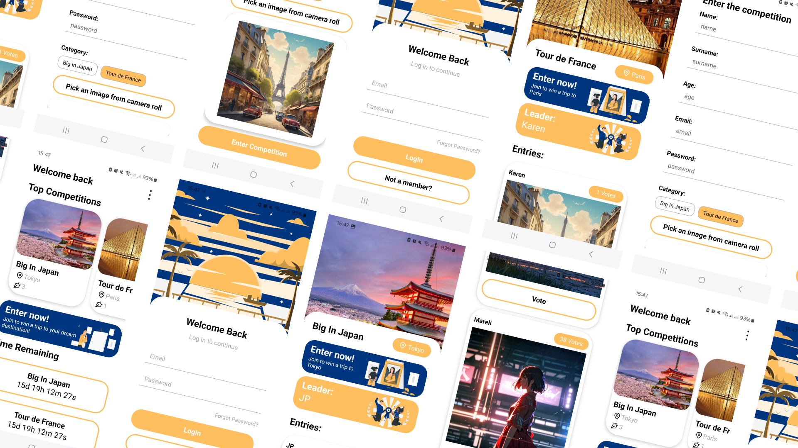

## 
Mareli Lourens  221119   Interactive Development 300 - Term 2

  

## 
Cross-Platform Mobile Development

## Table of Contents

* [About the Project](#about-the-project)
  * [Product mockup](#product-mockup)
  * [Project description](#project-description)
  * [Built With](#built-with)
* [Getting Started](#getting-started)
  * [How to install](#how-to-install)
* [Features and Functionality](#features-and-functionality)
* [Concept Process](#concept-process)
   * [Ideation](#ideation)
* [Development Process](#development-process)
    * [Highlights](#highlights)
    * [Challenges](#challenges)
* [Future Implementation](#future-implementation)
* [Conclusion](#conclusion)
* [Contact](#contact)

## About the project:

### Product mockup:

### Project description:
I worked on a project to develop a cross-platform mobile application that hosts a competition where user can win a trip to a country abroad. The user needs to submit an artwork related to the specific country they would like to travel to and then it gets added to the competition. Other users can then vote for their favorite artwork and the person with the most votes wins the competition

### Built with:
* [React Native](https://reactnative.dev/)
* [Firebase](https://firebase.google.com/)

## Getting Started:

### How to Install:

Navigate to the folder inside of your terminal and type npm install

## Features and Functionality:

The mobile application is structured around three primary user-facing pages. The first page serves as a login page where users who are already registered can log into the app. Alternatively if the person isn't already registered they can go to the sign up page and create their profile. After loggin in the user is directed to the homepage where they can view the top competitions as well as see a call to action button that encourages them to enter the competition and lastly a countdown timer that shows when the competitions end. The user can also view the other entries for the competitions if they navigate to the details screen. Here they're greeted with another call to action button as well as the leaderboard. Below that there is a feed view of all the entries for the competition. Finally when the user wants to enter the competiton they can navigate to the entries page.

## Concept Process:

### Ideation:

In the initial brainstorming stage of the project, I immediately thought of the app called Booking.com so I based my competition around them, acting as if I'm working for the company and creating the competition for them. (disclaimer: I'm not trying to impersonate the company and I'm working independently).

## Development Process

### Highlights

I found the experience of working on this project to be immensely rewarding. One of the key highlights for me was learning how to develop a mobile application.

Another aspect of the project that I found particularly enjoyable was the chance to further improve my understanding of how to implement crud functionality when working with a database. As a person who has worked with databases in the past, I was already familiar with the basic concepts and principles involved. However, this project allowed me to delve deeper into the topic and gain a more nuanced understanding of how databases work, specifically on how to use a firebase database, and how to troubleshoot issues that might arise. By creating my own database it helped me gain further insight into how they are structured.

Overall, I feel that this project was an incredibly valuable learning experience for me. Not only did it allow me to expand my skill sets and gain a deeper understanding of key concepts and techniques, but it also gave me the opportunity to work on a real-world project with practical applications.

### Challenges

Over the duration of this project, I encountered several obstacles that stretched my skill sets and took me beyond my familiar territory. Among these challenges, a particularly noteworthy hurdle emerged in working with images in firebase storage and connecting them to my database, specifically the nested collections in the database.

While the project undoubtedly presented substantial challenges, I view it as an invaluable learning journey. Navigating the complexities tied to the database that forced me to expand my developer capabilities and gain novel problem-solving insights. Reflecting on the project, a sense of accomplishment fills me as I consider what me managed to achieve.

## Future Implementation

Reflecting on our work on this project, there are several areas where I feel there is room for improvement and further development. One of the key areas where I would like to focus in the future is on stabilizing the code and improving consistency. While I was able to get the code working effectively for the purposes of this project, I feel that there is room for improvement in terms of streamlining the code, making it more efficient, and reducing redundancies. In addition, I would like to develop a more consistent coding style, to make the code more accessible to others and easier to maintain over time.

Another area where I would like to expand and enhance the project is in making it more interactive and engaging for users. While the website is functional and provides a useful service, I believe that there is room to add more interactivity and animation to the site, in order to make it more visually appealing and engaging for users. This might involve developing new features and functionalities.

## Conclusion

This project has been an incredible learning experience for me, and I'm truly grateful for the opportunity to work on it. Throughout the course of the project, I have learned so much, from technical skills to project management.

Working on this project has allowed me to put into practice many of the concepts and techniques I have learned in our studies, and it has also challenged me to expand my knowledge and skills. From developing the initial idea to designing and implementing the project, I have gained a deeper understanding of the software development process and the importance of effective communication and teamwork.

I am particularly proud of the progress I have made in developing my programming skills. I have also gained a greater appreciation for the importance of testing and debugging, and how these skills are critical to developing high-quality software.

Overall, this project has been an incredibly fulfilling experience, and I'm eager to continue working on it and implementing new features and improvements in the future.

## Authors
Mareli Lourens - [Find me on Github](https://github.com/MareliLourens)

## Contact
Mareli Lourens - [Email](mailto:221119@virtualwindow.co.za)

## Project Link
View on GitHub - https://github.com/MareliLourens/dv_300_term_2.git

